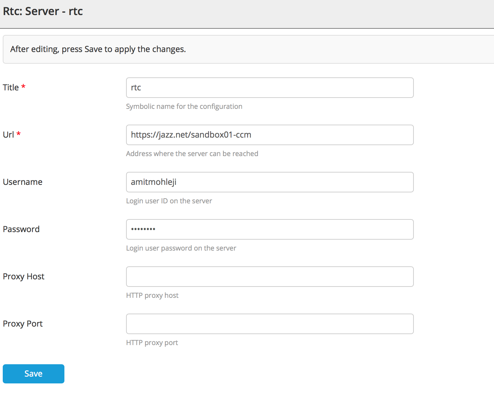
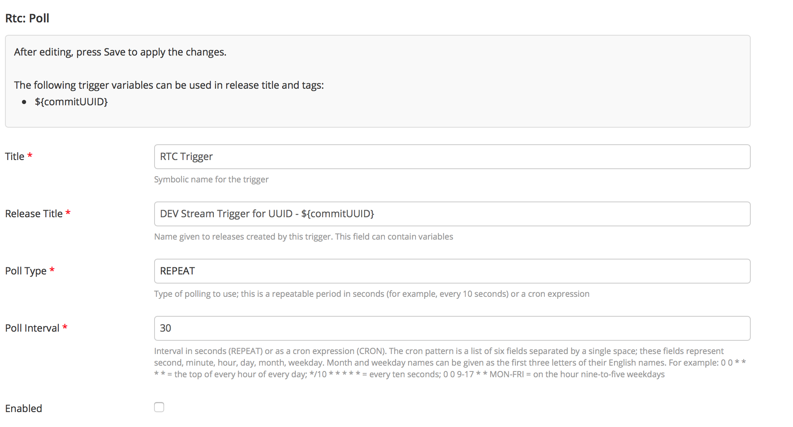
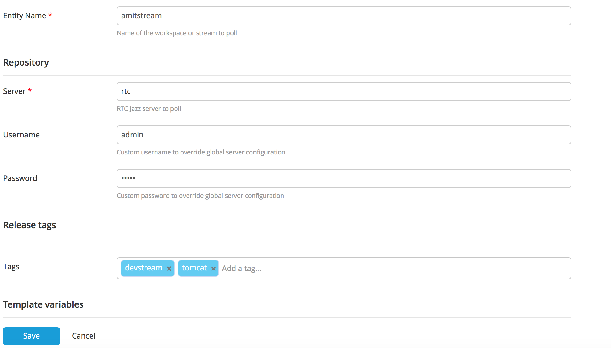

# Preface #

This document describes the functionality provided by the XL Release RTC Jazz Commit Trigger plugin.

See the **[XL Release Documentation](https://docs.xebialabs.com/xl-release/)** for background information on XL Release concepts.

# Overview #

The XL Release RTC Jazz Commit trigger plugin provides a trigger which automatically generates new release when a new commit appears in the specified workspace or stream.

# Requirements #

* **Requirements**
	* **XL Release** 4.x+

# Installation #

* Place the plugin JAR file into your `SERVER_HOME/plugins` directory.
* Also take the rtc6.0.1jars.zip file , unzip it and place the content under `SERVER_HOME/lib` directory

* Restart the server  

# Usage #

First, you need to add an entry in the [Configuration](https://docs.xebialabs.com/xl-release/how-to/create-custom-configuration-types-in-xl-release.html#configuration-page) section with information on how to connect to your RTC Jazz Commit repository:

The next step is to configure a new [trigger](https://docs.xebialabs.com/xl-release/how-to/create-a-release-trigger.html) for your XL Release [template](https://docs.xebialabs.com/xl-release/how-to/create-a-release-template.html):

